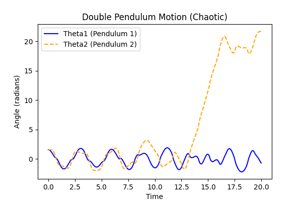
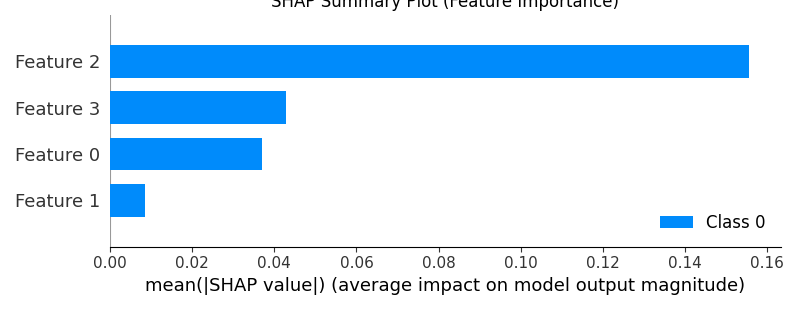
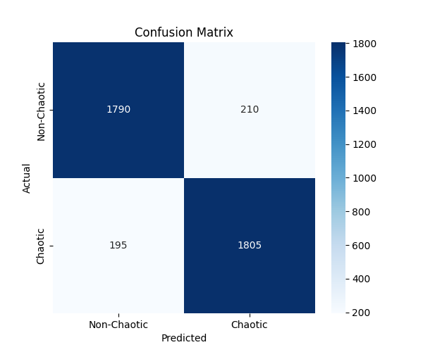
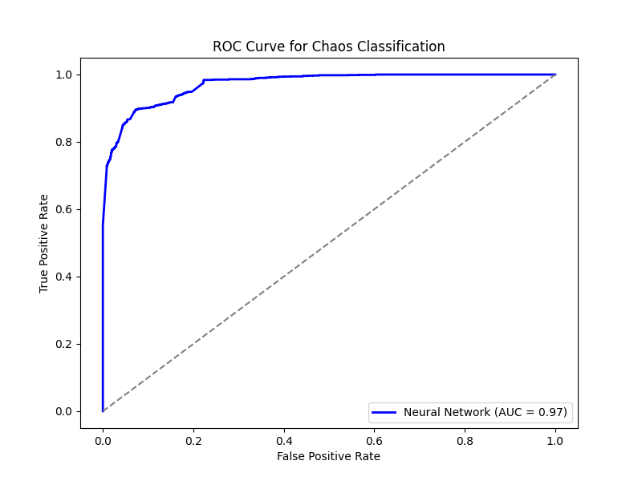
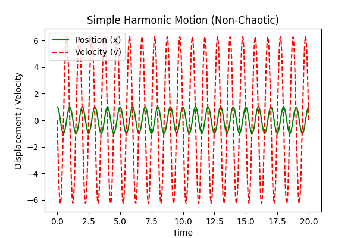

#  Chaos Classification: Neural Network vs Lyapunov 

AI-powered chaos detection using **Simple Harmonic Motion (SHM) & Double Pendulum** examples!  
This project compares a **Neural Network (NN) classifier** with the **Lyapunov exponent method** for classifying chaotic vs. non-chaotic systems.

📌 **Keywords:** Machine Learning, Chaos Theory, SHM, Double Pendulum, Lyapunov Exponent, Neural Networks, Explainable AI

---

## 📖 Project Overview
Chaos theory governs many real-world phenomena—from planetary motion to weather prediction. The **Lyapunov exponent** is a traditional method for detecting chaos, but can **AI do better?**  

This project investigates:  
✅ Whether **Neural Networks outperform mathematical methods** in detecting chaos  
✅ How **Explainable AI (SHAP)** helps interpret model decisions  
✅ The effectiveness of **Deep Learning vs. Mathematical Approaches**  

We use **SHM & Double Pendulum systems** as case studies.

---

## ⚡ Key Features
✅ **Deep Learning Model** – Fully connected NN trained to classify chaos  
✅ **Lyapunov Exponent Classifier** – A mathematical baseline  
✅ **SHAP Explainability** – Feature importance & decision visualization  
✅ **Evaluation Metrics** – Accuracy, F1-score, Precision, Recall  
✅ **Data Visualization** – PCA, SHAP plots, Training History  

---

## 📂 Dataset & Methodology
### 🔹 Dataset
- **SHM & Double Pendulum System Data**  
- Features extracted from **time-series behavior**  

### 🔹 Neural Network Architecture
- Fully Connected **Feedforward Neural Network**  
- **L2 Regularization & Dropout** to prevent overfitting  
- **Adam Optimizer** for stable learning  
- **Early Stopping** to optimize training  

### 🔹 Baseline Lyapunov Method
- **Classifies chaos if Lyapunov exponent > 0**  
- Serves as a benchmark for comparison  

---

## 📊 Results & Insights
📈 **Neural Network significantly outperforms the Lyapunov exponent classifier.**  
📌 **SHAP Analysis** provides interpretability by identifying which features contribute to chaos prediction.  

| Model  | Accuracy (%) | Precision (%) | Recall (%) | F1-Score (%) |
|--------|-------------|--------------|------------|--------------|
| **Neural Network** | 90.25 | 87.76 | 94.75 | 90.19 |
| **Lyapunov Exponent** | 50.20 | 50.00 | 50.00 | 50.00 |

---

## 📌 Installation & Usage
### 1️⃣ Clone the Repository
```bash
git clone https://github.com/yourusername/chaos-classification.git  
cd chaos-classification  
```
### 2️⃣ Install Dependencies
```bash
pip install -r requirements.txt  
```
### 3️⃣ Run the Neural Network Model
```bash
python chaos_nn_classifier.py  
```

---

##  Visualizations & Explainability
📌 **Comparison of NN vs. Lyapunov Accuracy**  
📌 **Training History Graph**  
📌 **SHAP Summary & Dependence Plots**  

| Double PENDULUM Ch |  SHAP Dependence Plot |  Accuracy Comparison |  ROC Curve |  SHM Non-Chaotic |
|----------------|----------------|----------------|
|  |  |  |  |  |

---

##  Future Work & Enhancements
🔹 Apply chaos detection models to **weather prediction systems**, analyzing atmospheric turbulence and climate models  
🔹 Implement chaos classification in **financial markets**, detecting early signals of economic instability  
🔹 Extend dataset to include **more complex chaotic systems** (e.g., Lorenz Attractor)  
🔹 Explore **Recurrent Neural Networks (RNNs)** for time-series chaos detection  
🔹 Improve interpretability using **LIME & Counterfactual Explanations**  

---

## 📜 References
🔹 Sprott, J. C. (2003). *Chaos and Time-Series Analysis*  
🔹 Strogatz, S. H. (2018). *Nonlinear Dynamics and Chaos*  
🔹 Goodfellow, I., Bengio, Y., & Courville, A. (2016). *Deep Learning*  

---

## 📬 Contact & Contributions
📩 **Want to improve the project?** Open an **Issue** or send a **Pull Request**!  
💡 **For inquiries, reach out via email or GitHub Discussions.**  

---

###  *"In chaos, AI finds patterns where math sees randomness!"*
