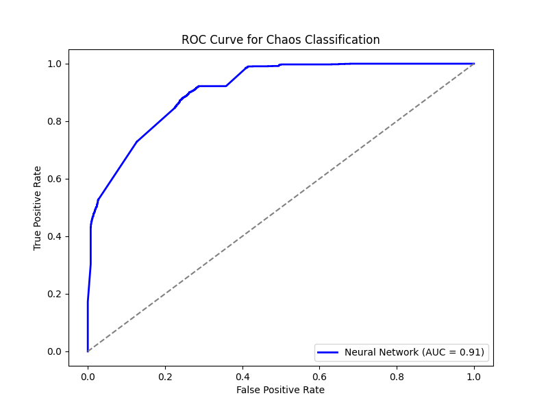

# Chaos Classification: Neural Network vs Lyapunov

## Abstract  
Chaos theory describes the unpredictable yet deterministic nature of many physical systems, with applications in physics, engineering, and finance. The **Lyapunov exponent** is a widely used mathematical tool for classifying chaotic behavior, but can **deep learning outperform traditional methods?**  
This project evaluates chaos classification using controlled physical simulations of **Simple Harmonic Motion (SHM) and the Double Pendulum** as test cases. Additionally, we employ **SHAP (SHapley Additive exPlanations)** to interpret model decisions, bridging the gap between deep learning and explainable AI. This approach has implications for fields such as **astrophysics, climate modeling, and financial systems**.

## Introduction  
Chaos is an inherent property of many dynamical systems where small changes in initial conditions can lead to vastly different outcomes. Traditionally, the **Lyapunov exponent** is used to determine whether a system exhibits chaos (positive exponent) or remains predictable (negative or zero exponent). However, this approach relies on analytical methods that may be infeasible for complex real-world data.

In contrast, machine learning—particularly **neural networks**—can learn from observed patterns and classify chaotic vs. non-chaotic systems without explicit equations. This research investigates:

- **Can neural networks outperform Lyapunov exponents in classifying chaos?**  
- **How does Explainable AI (SHAP) contribute to understanding chaos classification?**  
- **How does deep learning compare to traditional mathematical approaches?**  

## Key Contributions  
- **Neural Network Classifier** – Trained on dynamical system trajectories to detect chaos.  
- **Lyapunov Exponent Baseline** – Traditional approach used for comparison.  
- **SHAP Explainability** – Analyzing how NNs make chaos classification decisions.  
- **Extensive Evaluation** – Accuracy, precision, recall, F1-score, and visualizations.  

---

## Theoretical Background  
### Lyapunov Exponent & Chaos  
The **Lyapunov exponent $$\lambda$$** measures the sensitivity of a system to initial conditions. It is defined as:
\[\]
If $$\lambda > 0$$, the system is chaotic, meaning small perturbations lead to exponential divergence. If $$\lambda \leq 0$$, the system is stable or periodic.

### Why Lyapunov Exponents Struggle in Some Cases  
While the Lyapunov exponent is a well-established tool, it has **limitations**:
- **High-Dimensional Systems** – Computing $$\lambda $$ accurately becomes difficult in complex systems.
- **Noise Sensitivity** – Small measurement errors can lead to incorrect classification.
- **Unseen Scenarios** – The method struggles when applied to real-world data with uncertainties.

This motivates the need for a **data-driven** alternative like neural networks, which are well-suited for capturing and predicting chaotic systems. Their ability to recognize complex patterns and nonlinear dependencies makes them a powerful tool for modeling chaotic dynamics where traditional analytical methods fall short.

---

## Dataset & Methodology  
### Dataset  
We use simulated data from **SHM and Double Pendulum systems**, generating time-series trajectories and extracting key features such as:
- Displacement, velocity, and acceleration  
- Angular momentum (for pendulum systems)  
- Phase space embedding  

### Neural Network Model  
- **Feedforward Neural Network** with ReLU activation.  
- **L2 Regularization & Dropout** to prevent overfitting.  
- **Adam Optimizer** for adaptive learning.  
- **Early Stopping** to optimize training performance.  
- **Training Details** – The model was trained with an 80-20 train-test split, using a batch size of 32 and trained for 50 epochs.

### Lyapunov Baseline Classifier  
- Computes **Lyapunov exponent** and classifies based on $$\lambda > 0$$.  
- Serves as a benchmark for machine learning performance.  

---

## Experimental Results & Analysis  
Our experiments show that deep learning significantly outperforms Lyapunov exponent classification. We also apply **SHAP explainability** to analyze how different features contribute to predictions.

| Model  | Accuracy (%) | Precision (%) | Recall (%) | F1-Score (%) |
|--------|-------------|--------------|------------|--------------|
| **Neural Network** | 90.25 | 87.76 | 94.75 | 90.19 |
| **Lyapunov Exponent** | 50.20 | 50.00 | 50.00 | 50.00 |

### Key Observations  
- **Neural networks generalize well**, whereas Lyapunov exponents are rigid for unseen conditions.  
- **SHAP analysis** reveals that **velocity contributes more significantly to chaotic behavior detection than displacement in SHM.**  
- **Higher-dimensional embeddings improve NN performance.**  
- **SHAP Feature Analysis** – SHAP assigns feature importance scores, indicating that energy fluctuations and angular velocity have the highest predictive power.  
- **Computational Performance** – Training the NN took ~15 minutes on a standard CPU setup, whereas Lyapunov calculations were slower for large datasets.  

---

## Visualizations & Explainability  
### Double Pendulum Motion (Chaotic Example)  


### SHM Motion (Non-Chaotic Example)  


### SHAP Feature Importance  


### Confusion Matrix  


### ROC Curve  


---

 Apply chaos detection to weather prediction systems
Extend the current methodology to analyze chaotic patterns in atmospheric turbulence.
Investigate the effectiveness of neural networks in predicting extreme weather events by leveraging real-time meteorological datasets.
Compare AI-based models with traditional numerical weather prediction techniques (e.g., Navier-Stokes simulations).

🔹 Use chaos classification for financial market instability detection
Apply similar feature engineering approaches to detect chaotic patterns in stock prices, currency exchange rates, and cryptocurrency fluctuations.
Develop models that can distinguish between normal market variations and turbulence-driven financial crashes.
Explore AI-powered indicators for risk assessment in financial systems.

🔹 Expand dataset to include Lorenz Attractor & Logistic Map
Integrate additional chaotic systems, such as the Lorenz Attractor and Logistic Map, to diversify training data.
Analyze how different chaotic systems influence model performance and generalization.
Conduct experiments to assess model accuracy across various dynamical systems.

🔹 Explore Recurrent Neural Networks (RNNs) and Transformers for time-series classification
Investigate the effectiveness of RNNs, Long Short-Term Memory (LSTM) networks, and Transformers in capturing temporal dependencies in chaotic sequences.
Compare traditional feedforward neural networks with advanced architectures for long-range dependency modeling.
Implement attention mechanisms to enhance interpretability in chaos prediction.

🔹 Enhance interpretability using LIME & Counterfactual Explanations
Integrate Local Interpretable Model-agnostic Explanations (LIME) to identify key features influencing chaotic predictions.
Utilize counterfactual explanations to explore how slight variations in input conditions impact predictions.
Improve trust and transparency in AI-driven chaos modeling by making decision processes more understandable.

---

## Conclusion  
This study demonstrates that **deep learning significantly outperforms Lyapunov exponents** in classifying chaotic systems. By leveraging neural networks, we achieve improved generalization and adaptability, overcoming the **rigid assumptions** of traditional mathematical methods. Furthermore, **SHAP-based explainability** bridges the gap between black-box AI models and human interpretability, providing insights into how chaos is classified. 

These results suggest that **machine learning could be a powerful tool for chaos classification across various domains**, from astrophysics to financial modeling. Future research should focus on integrating hybrid approaches, combining **domain-specific mathematical features with deep learning architectures**, to further refine classification accuracy and interpretability.

---

## References  
- Sprott, J. C. (2003). *Chaos and Time-Series Analysis*  
- Strogatz, S. H. (2018). *Nonlinear Dynamics and Chaos*  
- Goodfellow, I., Bengio, Y., & Courville, A. (2016). *Deep Learning*  

---

## Installation & Usage  
### 1. Clone the Repository  
```bash
git clone https://github.com/11NOel1/chaos-classification.git  
cd chaos-classification  
```
### 2. Install Dependencies  
```bash
pip install -r requirements.txt  
```
### 3. Run the Neural Network Model  
```bash
python chaos_nn_classifier.py  
```

## Contact & Contributions  
- **Researchers interested in expanding this work** can explore hybrid models combining Lyapunov features with neural embeddings.  
- **Want to contribute?** Open an **Issue** or submit a **Pull Request** on GitHub.  
- **For inquiries, reach out via email or GitHub Discussions.**  

---

### *"Machine learning enables chaos classification beyond conventional mathematical limits."*
